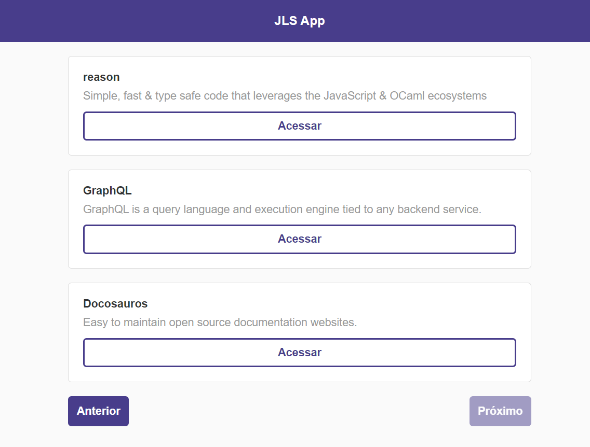
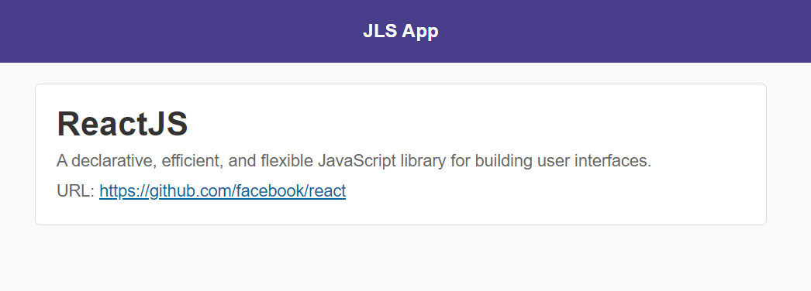

# reactBasico
## Primeira aplicação criada em React através de um curso BÁSICO fornecido pela empresa Rocketseat.

- A aplicação consome dados de uma API externa para a listagem de produtos.

- Ao clicar no botão "Acessar" exibido na imagem acima, conseguimos ver os detalhes do produto listado.

